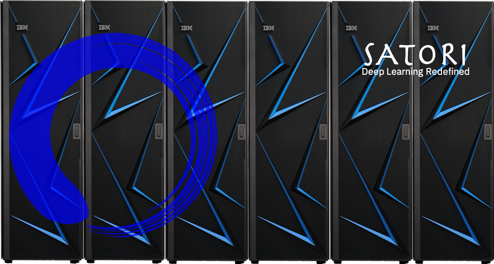

## SATORI: Getting Started Documentation for Early Access (EA)
This section provides a "lightning-quick" guide for early access of Satori users such as:
- Howto optain your login credentials
- Howto [connect in the Satori](satori-ssh.md) cluster via SSH/SCP/HTTPS
- [Installing Python](https://github.com/mit-satori/getting-started/blob/master/satori-ai-frameworks.md) environment (Anaconda) on your login profile
- [Installing WMLCE](https://github.com/mit-satori/getting-started/blob/master/satori-ai-frameworks.md) optimized Machine Learning and Deep Learning libraries and frameworks  on your login profile
- Examples of training jobs submision to the Workload Manager
- How to manage [distributed deep learning in TensorFlow and Pytorch](https://github.com/mit-satori/getting-started/blob/master/satori-distributed-deeplearning.md)
- Are you training large models that cannot be fit into GPU memory? Have a look how you can [enable Large Model Support (LMS)](https://github.com/mit-satori/getting-started/blob/master/satori-large-model-support.md) in your TensorFLow or Pytorch python scripts.
- Example of Snap Machine Learning [(SnapML/pai4sk)](https://github.com/IBM/powerai/tree/master/examples/SnapML)
- [Additional trainings](https://github.com/mit-satori/getting-started/blob/master/satori-training.md) (video format) for CUDA UNIFIED MEMORY, GPUDirect, LSF Workload Manager, POWER9 SMT4 etc
- [Troubleshooting](satori-troubleshooting.md)

+ You don't find what you where looking for? have a look to [conda cheet sheet](https://github.com/mit-satori/getting-started/blob/master/satori-conda-cheatsheet.pdf) and WMLCE extended documentation [here](https://www.ibm.com/support/knowledgecenter/SS5SF7_1.6.2/navigation/wmlce_getstarted.html) before asking for help.
